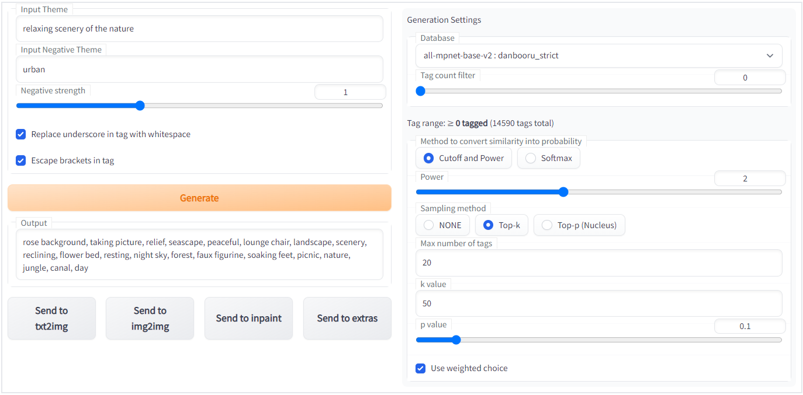

# text2prompt
 

 This is an extension to make prompt from simple text for [Stable Diffusion web UI by AUTOMATIC1111](https://github.com/AUTOMATIC1111/stable-diffusion-webui).  
 Currently, only prompts consisting of some danbooru tags can be generated.

## Installation
### Extensions tab on WebUI
Copy `https://github.com/toshiaki1729/stable-diffusion-webui-text2prompt.git` into "Install from URL" tab and "Install".

### Install Manually

To install, clone the repository into the `extensions` directory and restart the web UI.  
On the web UI directory, run the following command to install:
```commandline
git clone https://github.com/toshiaki1729/stable-diffusion-webui-text2prompt.git extensions/text2prompt
```


## Usage
1. Type some words into "Input Theme"
1. Push "Generate" button


### Tips
- For more creative result
  - increase "k value" or "p value"
  - disable "Use weighted choice"
  - use "Cutoff and Power" and decrease "Power"
  - or use "Softmax" (may generate unwanted tags more often)
- For more strict result
  - decrease "k value" or "p value"
  - use "Cutoff and Power" and increase "Power"
- You can enter very long sentences, but the more specific it is, the fewer results you will get.

## How it works
 It's doing nothing special;
 
 1. Danbooru tags and it's descriptions are in the `data` folder
    - descriptions are generated from wiki and already tokenized
    - [all-mpnet-base-v2](https://huggingface.co/sentence-transformers/all-mpnet-base-v2) model is used to tokenize the text
    - for now, some tags (such as <1k tagged or containing title of the work) are deleted to prevent from "noisy" result
 1. Tokenize your input text and calculate cosine similarity to each tag descriptions
 1. Choose some tags depending on their similarities

 
 
---

 ### More detailed
 $i \in N = \\{1, 2, ..., n\\}$ for index number of the tag  
 $s_i = S_C(d_i, t)$  for cosine similarity between tag description $d_i$ and your text $t$
 $P_i$ for probability for the tag to be chosen

 ### "Method to convert similarity into probability"
 #### "Cutoff and Power"
 
 $$p_i = \text{clamp}(s_i, 0, 1)^{\text{Power}} = \text{max}(s_i, 0)^{\text{Power}}$$

 #### "Softmax"
 
 $$p_i = \sigma(\\{s_n|n \in N\\})_i = \dfrac{e^{s_i}}{ \Sigma_{j \in N}\ e^{s_j} }$$

 ### "Sampling method"
 Yes, it doesn't sample like other "true" language models do, so "Filtering method" might be better.
 
 #### "NONE"

 $$P_i = p_i$$

 #### "Top-k"

 $$
 P_i = \begin{cases} 
 \dfrac{p_i}{\Sigma p_j \text{ for all top-}k} & \text{if } p_i \text{ is top-}k \text{ largest in } \\{p_n | n \in N \\} \\
 0 & \text{otherwise} \\
 \end{cases}
 $$

 #### "Top-p (Nucleus)"
 - Find smallest $N_p \subset N$ such that $\Sigma_{i \in N_p}\ p_i\ \geq p$
   - set $N_p=\emptyset$ at first, and add index of $p_{(k)}$ into $N_p$ where $p_{(k)}$ is the $k$-th largest in $\\{p_n | n \in N \\}$ for $k = 1, 2, ..., n$, until the equation holds.

$$
P_i = \begin{cases} 
\dfrac{p_i}{\Sigma p_j \text{ for all }j \in N_p} & \text{if } i \in N_p \\
0 & \text{otherwise} \\
\end{cases}
$$

Finally, the tags will be chosen randomly while the number $\leq$ "Max number of tags".
